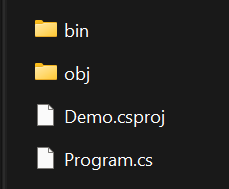

> The beginning is the most important part of the work.
> 
> -- <cite>Plato</cite>

As you start your journey to become a .NET developer, the information available out there can be a bit overwhelming. In this blog post, I would like to boil it down to the very basics on how you can start working on learning/improving your skills as a junior .NET developer. The good news is that running your first .NET project has never been easier. So, let's get started.

### Install .NET SDK

In order to get started the first thing you will need is the .NET SDK insatalled on your development machine. You can find the installed or installation instruction on the .NET SDK website. 
- [Download and Install SDK](https://dotnet.microsoft.com/en-us/download)

Once the dotnet sdk is installed, you can verify that it works by opening a command prompt or terminal application and running the following command.

```bash
dotnet --version
```

This should print out something like below. The version number will be different depending on what version was available at the time you install.

> 8.0.302

Or run the command below for a more detailed information about the sdk installed.
```bash
dotnet --info
```

### Run a basic console application

Now that you have dotnet SDK installed, we can get started on learning some of the basic fundamentals of C# language basics and .NET projects. 

In the command or terminal window that you opened earlier, you can run the command below to create a new basic .NET application.

```bash
dotnet new console -n Demo
```

The command creates a `new` project of `console` type with name `Demo` in a new directory. You should be able to navigate into the newly created folder inside the terminal window by running the command below

```bash
cd Demo
```

If you open Windows Explorer (or Finder on Mac OS) and look at the folder, you will notice there are the following files in the `Demo` folder that got created.



The `Demo.csproj` file and `Program.cs` files can be opened in a text editor to edit or read the contents. 

In the terminal window, you should now be able to run the following command to run your first .NET project.

```bash
dotnet run Demo.csproj
```
This will print the following text in your terminal.
> Hello, World!

Congratulations🎉🎉! You just ran your first .NET project.

*NOTE*: I ignored the `obj` and `bin` directories for the time being to keep things simple, as they are a bit more advanced topics. Just note that these are auto generated folders and will automatically update as you work on the project. Except from very rare cases, you will not need to touch these folders.

In the next tutorial, we will discuss more details about the contents of `Demo.csproj` and `Program.cs` files.

### Additional Resources:
1. [Learn C# Basics](https://learn.microsoft.com/en-us/collections/yz26f8y64n7k07?WT.mc_id=dotnet-35129-website)
1. [Write your first C# code](https://learn.microsoft.com/en-us/training/modules/csharp-write-first)
